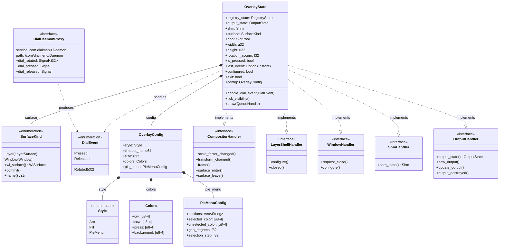
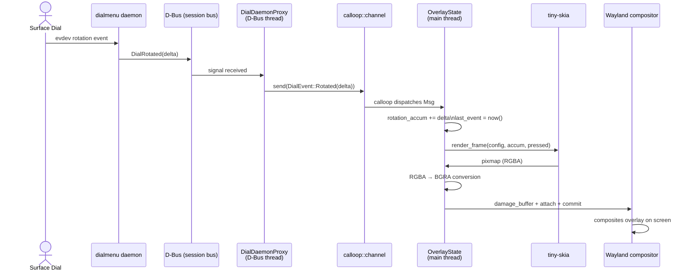
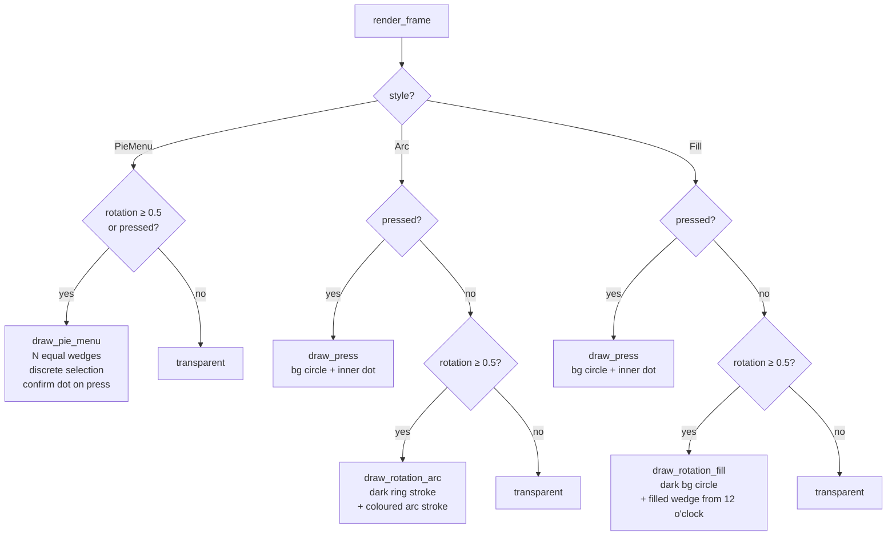

# Architecture

## Class Diagram



## Component Diagram

```mermaid
graph TB
    subgraph Hardware
        DIAL[Surface Dial]
    end

    subgraph dialmenu_daemon["dialmenu daemon (separate process)"]
        EVDEV[evdev reader]
    end

    subgraph surface_dial_overlay["surface-dial-overlay"]
        subgraph dbus_thread["D-Bus thread  (tokio current_thread)"]
            PROXY[DialDaemonProxy\nzbus async listener]
        end

        CHAN["calloop::channel\n(thread bridge)"]

        subgraph main_thread["Main thread  (calloop event loop)"]
            STATE[OverlayState\nhandle_dial_event]
            TICK[tick_visibility\n100 ms heartbeat]
            RENDER[render_frame\ntiny-skia]
            BUF[wl_shm buffer\nRGBA→BGRA]
        end
    end

    subgraph Wayland_compositor["Wayland compositor"]
        LAYER[wlr-layer-shell\noverlay surface]
        XDG[xdg-window\nfallback]
    end

    SCREEN[Display]

    DIAL      -->|evdev events|    EVDEV
    EVDEV     -->|D-Bus signals|   PROXY
    PROXY     -->|DialEvent|       CHAN
    CHAN       -->|calloop Msg|    STATE
    STATE      -->|triggers|       RENDER
    TICK       -->|timeout reset|  STATE
    RENDER     -->|pixmap|         BUF
    BUF        -->|attach+commit|  LAYER
    BUF        -.->|fallback|      XDG
    LAYER      -->|composite|      SCREEN
    XDG        -.->|composite|     SCREEN
```

## Sequence Diagram — Dial Rotation Event



## Sequence Diagram — Visibility Timeout

```mermaid
sequenceDiagram
    participant Loop as calloop event loop
    participant State as OverlayState
    participant Skia as tiny-skia
    participant Wl as Wayland compositor

    loop Every 100 ms
        Loop  ->> State : tick_visibility()
        alt last_event elapsed > timeout_ms
            State ->> State : rotation_accum = 0\nis_pressed = false
            State ->> Skia  : render_frame → transparent
            Skia  ->> State : empty pixmap
            State ->> Wl    : commit transparent buffer
        else still active
            State ->> State : no-op
        end
    end
```

## Rendering Style Dispatch


